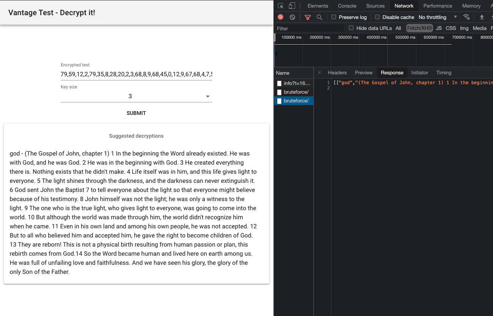

A crack my pass home assigment

part_a contains the basic logic and tests
see local README.md

server folder contains a simple m=flask implementation based on part_a
see local READM.md on running the server

